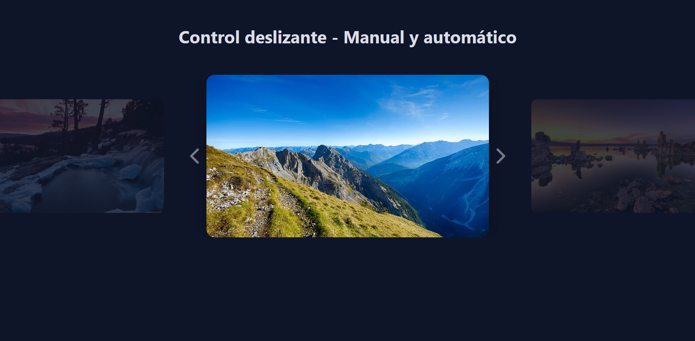

# Control Deslizante Manual y Automático

Control deslizante (slider) que permite la navegación de imágenes de forma manual y automática.

---
<a href="https://brionex.github.io/manual-and-automatic-slider/" target="_blank">Control Deslizante Manual y Automático</a>

## Características

- Navegación manual y automática.
- Animaciones suaves y optimizadas.

## Tecnologías Utilizadas

- HTML
- CSS
- JavaScript
